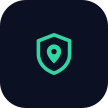
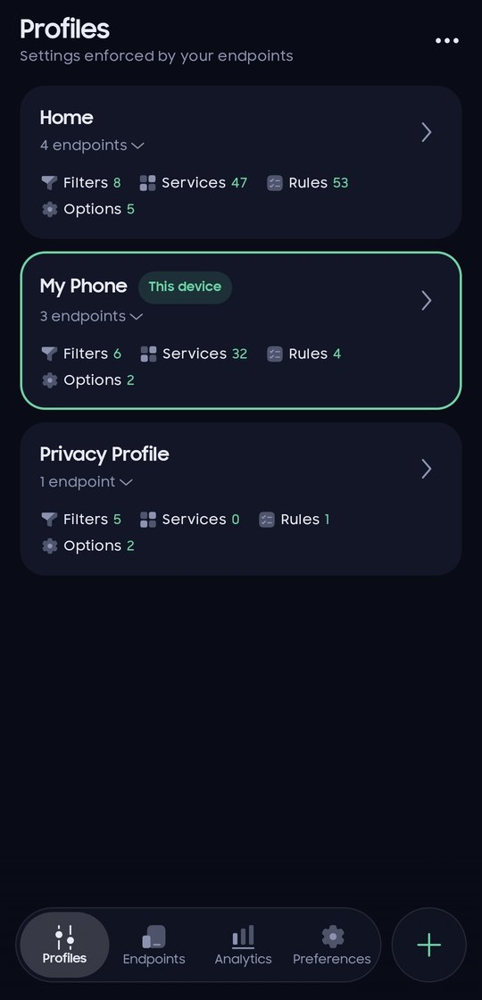
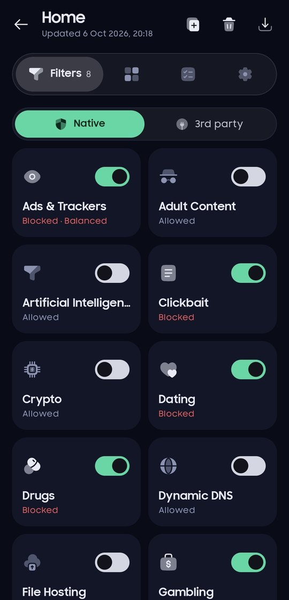
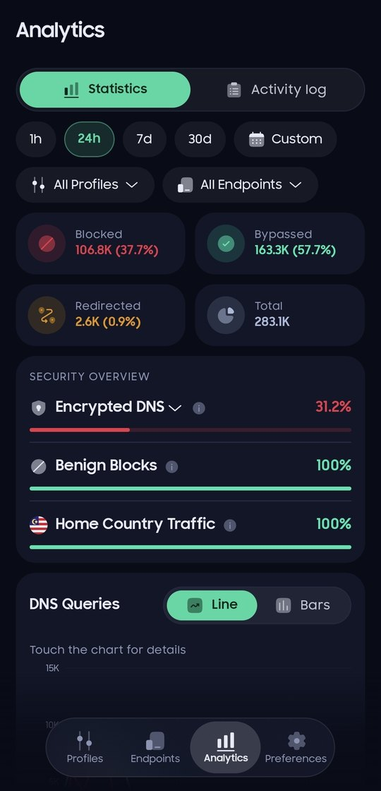
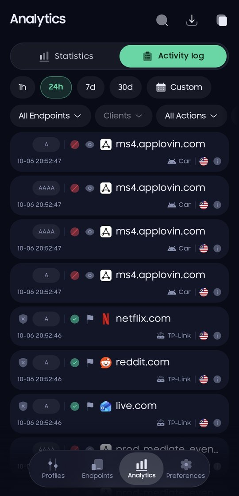
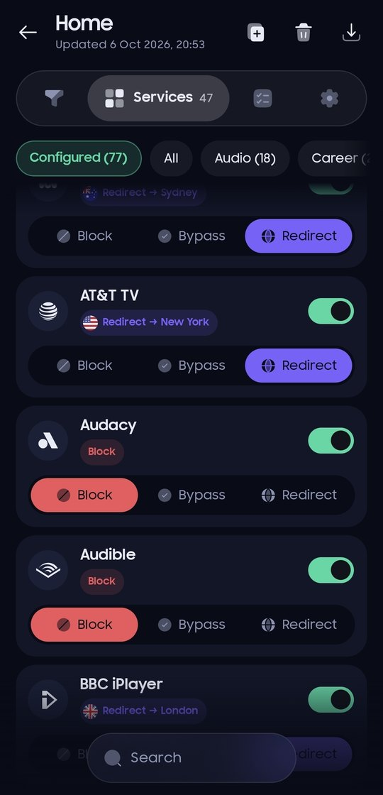
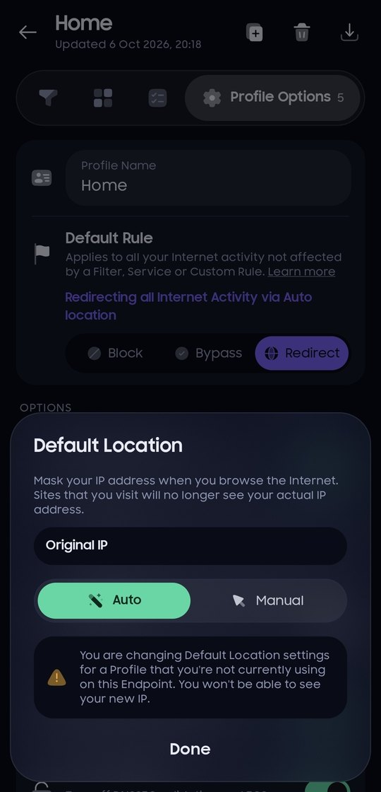
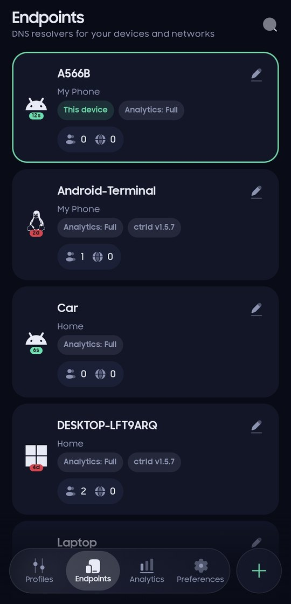
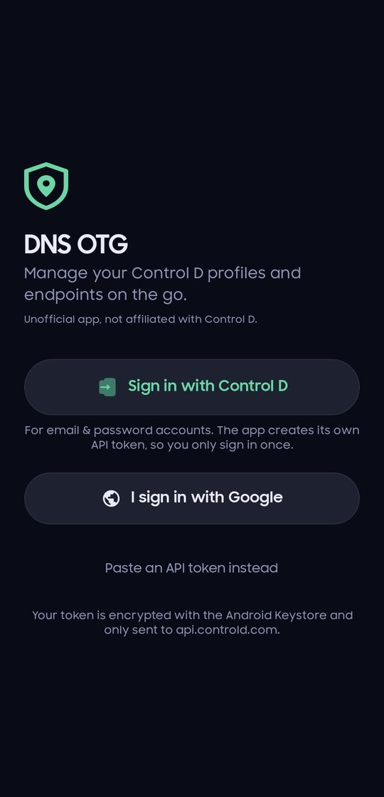

<p align="center">
  
</p>

<h1 align="center">DNS On The Go</h1>

<p align="center">
  Manage your <a href="https://controld.com">Control D</a> DNS from your phone.<br>
  Profiles, endpoints, statistics and the live activity log, in one Android app.
</p>

<p align="center">
  <a href="../../releases/latest"></a>
  
  
</p>

<p align="center">
  <a href="https://tangrow1105.github.io/dns-otg/">Website</a> ·
  <a href="../../releases/latest">Download</a> ·
  <a href="#help-test-on-google-play">Test on Google Play</a> ·
  <a href="https://tangrow1105.github.io/dns-otg/privacy.html">Privacy policy</a>
</p>

<p align="center">
  
  
  
  
</p>

## What you can do

**Profiles.** Turn filters on and off, set services to block, bypass or redirect, write custom rules and folders, and change profile options like the Default Rule and Default Location. The profile this phone uses is highlighted.

**Endpoints.** See every device with its last activity, profile, analytics level and ctrld version. Create, edit and delete endpoints, check resolvers, and manage clients and known IPs.

**Statistics.** Blocked, bypassed and redirected totals, a security overview, query charts, trends and top lists, for any time range, profile or endpoint.

**Activity log.** Live DNS queries with filters for endpoint, client, action, protocol and more. Open any query for details, or turn it into a rule with one tap.

**Domain Test.** Check how any endpoint answers a domain (blocked, bypassed or redirected, and by which filter, service or rule), and report false positives or negatives to Control D.

**Account.** Billing and receipts, account settings, Control D notifications and changelog, and the same status check as controld.com/status.

<table>
  <tr>
    <td align="center"><br><sub>Services</sub></td>
    <td align="center"><br><sub>Default Location</sub></td>
    <td align="center"><br><sub>Endpoints</sub></td>
    <td align="center"><br><sub>Sign in</sub></td>
  </tr>
</table>

## Install

1. Download the latest `DNS-OTG-x.y.z.apk` from [Releases](../../releases/latest) on your phone.
2. Open it. If Android asks, allow installing apps from your browser or file manager.
3. Sign in.

Updates install over the previous version and keep you signed in. Requires Android 8.0 or newer.

## Help test on Google Play

DNS On The Go is in closed testing on Google Play and needs testers before it can go public. To join:

1. Join the Google Group **[groups.google.com/g/dns-otg](https://groups.google.com/g/dns-otg)** with the Google account you use on your phone.
2. Open **[play.google.com/apps/testing/app.dnsotg](https://play.google.com/apps/testing/app.dnsotg)** and tap **Become a tester**.
3. Install the app from **[Google Play](https://play.google.com/store/apps/details?id=app.dnsotg)** and keep it installed for at least 14 days.

You don't need a Control D account to help: installing and keeping the app is enough. If you already have the GitHub version, uninstall it first, because the two are signed differently.

## Signing in

- **Sign in with Control D**: for email and password accounts. You sign in on Control D's own page inside the app, and the app creates its own API token named after your device, so you only do this once.
- **Google accounts**: Google doesn't allow its sign-in inside apps, so tap **I sign in with Google**. The app opens the Control D dashboard in Chrome, where you create a Write token and copy it. Back in the app, tap **Use** on the copied token.
- **API token**: paste any Control D API token. If one is on your clipboard when you open the app, it offers to use it.

## Privacy

- Your token is encrypted with the Android Keystore and never leaves your phone except to authenticate with Control D.
- The app talks only to Control D's own servers. No analytics, no ads, no tracking, no servers of its own.
- The GitHub version also checks GitHub Releases for updates and shows a download link when a new version is out. The Google Play version leaves updates to Play.
- Full details in the [privacy policy](https://tangrow1105.github.io/dns-otg/privacy.html).

## Build

Open the project in Android Studio, or run:

```
./gradlew assembleDebug
```

Debug builds install next to the release app (`app.dnsotg.debug`). Release builds are signed with the key in a `keystore.properties` file (`storeFile`, `storePassword`, `keyAlias`, `keyPassword`) whose path is set with the `DNSOTG_KEYSTORE_PROPS` environment variable; without one they fall back to the debug key. The **Draft release** GitHub workflow builds a signed APK into a draft release from repository secrets.

## Credits

- Icons: [Solar](https://www.figma.com/community/file/1166831539721848736) by 480 Design, [CC BY 4.0](https://creativecommons.org/licenses/by/4.0/)
- Brand logos: [Simple Icons](https://simpleicons.org) (CC0). Each logo is a trademark of its owner.
- Protocol badge lettering: [Nunito](https://fonts.google.com/specimen/Nunito), SIL Open Font License

## License

[MIT](LICENSE). The icons and logos listed under Credits keep their own licenses.

## Disclaimer

DNS On The Go is an independent project. It is not made by, affiliated with or endorsed by Control D. Control D is a trademark of its owner.
